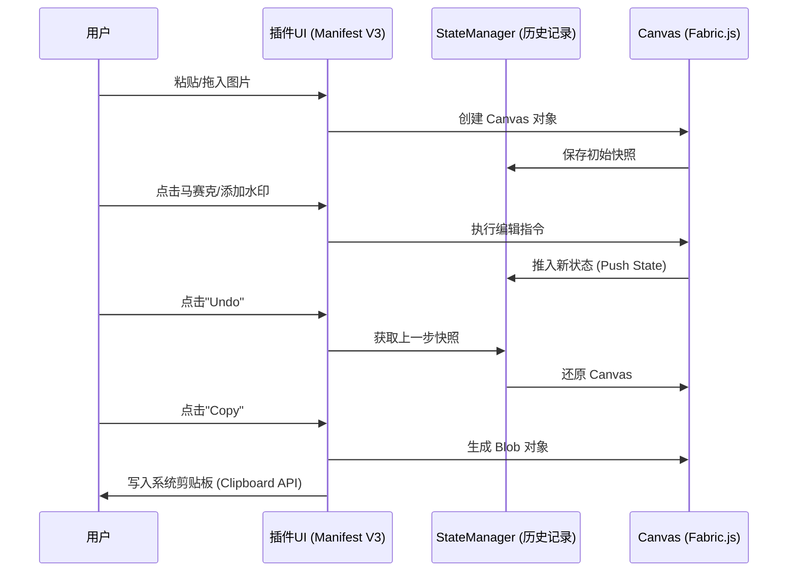

# 产品需求文档 (PRD) - 极简图片编辑器 (Chrome Extension)

## 核心目标 (Mission)
打造一款运行在浏览器内的、极简且专业的本地图片编辑插件。主打“即开即修，本地处理，安全隐私”。

## 用户画像 (Persona)
- **职场精英/行政人员**：需要快速给截图打码、调整尺寸以放入文档。
- **运营/美工辅助**：快速为素材添加水印或简单裁剪。
- **痛点**：无需下载第三方软件，不信任在线图片编辑器的隐私安全性，追求极速响应。

---

## V1: 最小可行产品 (MVP) 需求清单

### 1. 导入与画布管理
- **多渠道导入**：支持点击上传、拖拽上传、剪贴板直接粘贴 (Ctrl+V)。
- **响应式画布**：Canvas 自动适配图片比例，支持滚轴缩放预览。
- **状态管理 (New)**：支持 **撤销 (Undo)** 和 **重做 (Redo)**，记录至少 10 步操作历史。

### 2. 编辑工具箱 (方案 A 布局)
- **核心三件套**：
  - **裁剪 (Crop)**：支持自由裁剪，内置常用比例（1:1, 4:3, 16:9）。
  - **缩放 (Resize)**：精确修改宽高像素或百分比，支持锁定比例。
  - **马赛克 (Mosaic/Blur)**：画笔式像素化/模糊，用于快速去水印或隐藏敏感词。
- **水印系统**：
  - **文字水印**：可调字体、颜色、透明度、旋转角度。
  - **图片水印**：支持上传 Logo，可调大小及透明度。

### 3. 输出与流转
- **一键下载**：导出为 PNG (保留透明度) 或 JPG。
- **快捷复制**：一键将处理后的结果写入系统剪贴板（核心提效功能）。

---

## 视觉原型 (Selected Prototype: A - The Studio)

```text
_____________________________________________________
| [Logo] |  [Undo] [Redo] | [Copy] [Download] |  (?) |
|---------------------------------------------------|
| Sidebar (Tools) |                                 |
| [Crop]          |         _________________       |
| [Resize]        |        |                 |      |
| [Mosaic] <active|        |    (IMAGE)      |      |
| [Text]          |        |    CANVAS       |      |
| [Image]         |        |_________________|      |
|-----------------|                                 |
| Property Panel  |                                 |
| - Brush Size: 10|             [ Zoom: 100% ]      |
| - Opacity: 0.8  |                                 |
|_________________|_________________________________|
```

---

## 架构设计蓝图

### 1. 核心流程图 (序列图)


### 2. 组件交互说明
- **`background.js`**: 处理插件点击启动。
- **`main.html/css`**: 方案 A 的 Studio 设计实现。
- **`editor.js`**: 核心逻辑。
  - `ImageLoader`: 处理多种导入方式。
  - `ToolKit`: 包含各编辑功能的策略实现（裁剪、缩放等）。
  - `HistoryManager`: 实现 Undo/Redo 的栈结构。
- **`export.js`**: 处理 Canvas 到 Blob 的转换及剪贴板写入。

### 3. 技术选型与风险
- **核心库**: `Fabric.js` (强烈推荐)。理由：它将 Canvas 操作对象化，非常适合处理“文字水印”、“图片水印”以及“Undo/Redo”状态管理。
- **技术风险**:
  - **剪贴板权限**: Manifest V3 下 Clipboard 写入需要用户触发 (User Activation)，需确保在按钮点击回调内完成。
  - **内存占用**: 插件在长时间开启大图编辑时，需要注意内存清理，防止 OOM (Out of Memory)。
