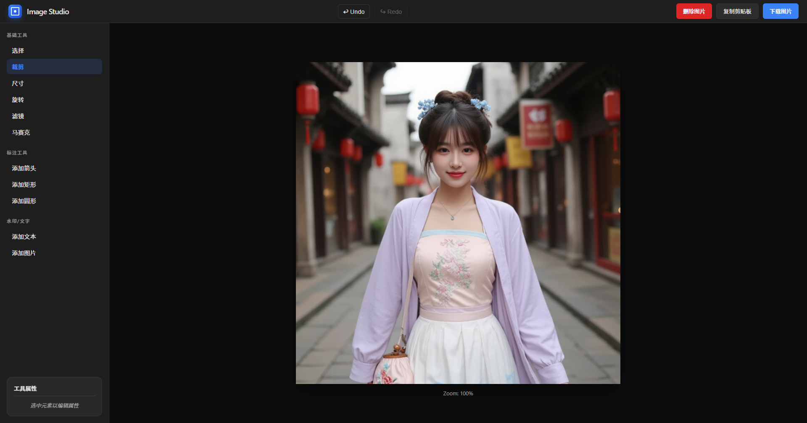

# 极简图片编辑器 (Image Studio)

一款基于 Chrome Manifest V3 开发的极简且专业的浏览器插件图片编辑器。主打“即开即修，本地处理，安全隐私”。

## 界面预览



## 核心特性

- **多渠道导入**：支持点击上传、拖拽上传以及剪贴板直接粘贴 (Ctrl+V)。
- **基础编辑工具**：
  - **裁剪 (Crop)**：支持自由裁剪，内置常用比例。
  - **尺寸调整 (Resize)**：精确修改宽高像素，支持锁定比例。
  - **旋转 (Rotate)**：支持图片旋转调整。
  - **滤镜 (Filter)**：内置多种基础滤镜效果。
  - **马赛克 (Mosaic)**：画笔式像素化，用于快速遮盖敏感信息。
- **标注与水印**：
  - **形状标注**：支持添加箭头、矩形、圆形等标注。
  - **文本/水印**：支持添加自定义文本水印及图片水印。
- **状态管理**：支持 **撤销 (Undo)** 和 **重做 (Redo)**，记录操作历史。
- **删除与重置**：支持一键删除当前图片并重置编辑器状态。
- **高效输出**：
  - **一键下载**：导出为 PNG 图片。
  - **快捷复制**：一键将处理后的结果复制到系统剪贴板。

## 技术栈

- **核心库**：[Fabric.js](http://fabricjs.com/) - 强大的 Canvas 操作库。
- **AI 辅助**：集成 MediaPipe Selfie Segmentation (可选扩展)。
- **规范**：Chrome Extension Manifest V3。

## 项目结构

```text
├── assets/             # 静态资源
├── lib/                # 第三方依赖库 (Fabric.js, MediaPipe等)
├── scripts/            # 核心业务逻辑
│   ├── main.js         # 主入口逻辑
│   ├── history.js      # 历史记录管理 (Undo/Redo)
│   └── tools.js        # 编辑工具实现
├── styles.css          # 样式表
├── manifest.json       # 插件配置文件
└── index.html          # 编辑器主界面
```

## 安装与使用

1. 下载或克隆本项目到本地。
2. 打开 Chrome 浏览器，访问 `chrome://extensions/`。
3. 开启右上角的“开发者模式”。
4. 点击“加载已解压的扩展程序”，选择本项目所在的文件夹。
5. 点击插件图标即可开始使用。

## 隐私声明

本项目所有图片处理均在本地浏览器内完成，不会上传到任何服务器，确保您的隐私安全。
