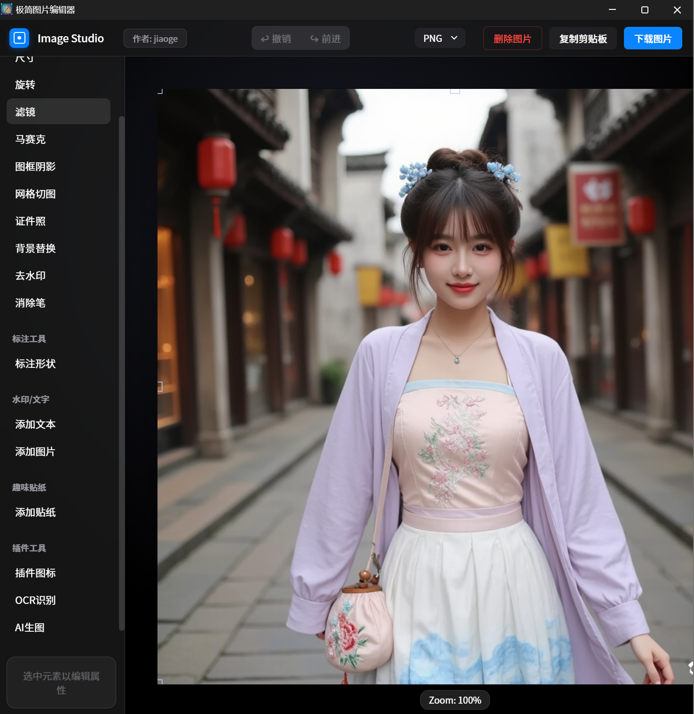

# 极简图片编辑器 (Image Studio)

一款基于 Chrome Manifest V3 开发的极简且专业的浏览器插件图片编辑器。主打"即开即修，本地处理，安全隐私"。

## 界面预览



## 核心特性

### 导入方式
- **点击上传**：点击上传区域选择图片
- **拖拽上传**：直接拖拽图片到编辑区域
- **剪贴板粘贴**：使用 Ctrl+V 直接粘贴剪贴板中的图片

### 基础工具
- **裁剪 (Crop)**：支持自由裁剪，内置常用比例（1:1、3:4、4:3、9:16、16:9），4x4 网格辅助
- **尺寸调整 (Resize)**：精确修改宽高像素
- **旋转 (Rotate)**：支持顺时针/逆时针 90°/180° 旋转
- **滤镜 (Filter)**：调整亮度、对比度、饱和度等效果
- **马赛克 (Mosaic)**：画笔式马赛克，支持三种效果模式，用于遮盖敏感信息
  - **纯色块**：经典像素化效果，可调节像素块大小
  - **高斯模糊**：柔和模糊效果，可调节模糊半径
  - **毛玻璃**：模拟真实毛玻璃质感，可调节不透明度
- **图框阴影 (Frame)**：为图片添加边框，支持矩形/圆形两种形状，多种边框风格可选
  - **简约风格**：白边、黑边
  - **艺术风格**：渐变边框、复古相框、拍立得
  - **毛绒绒风格**：奶白、浅驼、樱花粉（模拟毛绒针织肌理，适合宠物、儿童、软萌风图片）
  - 支持多种阴影效果：柔和阴影、强烈阴影、长投影、内阴影
- **去水印 (Remove Watermark)**：智能裁剪法，通过选择位置和比例快速移除边缘水印

### 高级功能
- **OCR 文字识别**：集成百度云 API，一键提取图片中的文字内容，支持结果复制，密钥本地加密存储
- **网格切图**：将图片按指定行列数平均切割，自动打包成 ZIP 下载
- **证件照**：AI 一键生成标准证件照，支持多种尺寸规格（1寸、2寸等），可选底色，抠图人像支持二次调整
- **AI 背景替换**：智能抠图移除背景，支持纯色或自定义图片背景

### 标注工具
- **添加形状**：集合了箭头、矩形、圆形、直线、菱形等常用标注形状，支持修改线条颜色、粗细及虚实样式
- **连续添加**：标注工具支持连续添加多个形状，无需重复点击工具按钮

### 水印/文字 / 贴纸
- **添加文本**：插入自定义文字，支持**预设样式**（内部资料、保密、绝密、严禁复制），支持**全图平铺水印**模式（可调旋转角度和间距）
- **连续操作**：文字、贴纸、图片水印工具都支持连续添加多个元素
- **趣味贴纸**：内置 16 款 Emoji 表情贴纸 + 8 款精美图标贴纸（书籍、橡皮擦、书签、眼镜、耳机、咖啡、信封、计算器），分类展示，支持拖动、缩放、旋转
- **添加图片**：插入图片作为水印，可调整透明度、缩放比例

### 插件工具
- **图标生成**：自动生成浏览器插件所需的多尺寸图标（16x16、32x32、48x48、128x128），支持 AI 文生图

### 状态管理
- **撤销/重做**：支持 Ctrl+Z 撤销和 Ctrl+Y 重做，记录完整操作历史。针对 2.4 版本优化：完全支持画布尺寸变更的回溯，撤销提示内容全面汉化。
- **删除图片**：一键删除当前图片并重置编辑器状态

### 导出功能
- **多格式导出**：支持 PNG、JPEG、WEBP 三种格式
- **质量调整**：JPEG/WEBP 格式支持质量参数调整（0.1-1.0）
- **一键下载**：快速下载处理后的图片
- **复制剪贴板**：一键将结果复制到系统剪贴板

### 界面交互
- **可拖拽侧边栏**：左侧工具栏与预览区之间的分隔线支持左右拖拽调整宽度
- **动态属性面板**：选中工具或画布上的元素后，面板内容动态更新，支持实时参数调整

## 技术栈

- **核心库**：[Fabric.js](http://fabricjs.com/) - 强大的 Canvas 操作库。
- **AI 辅助**：集成 MediaPipe Selfie Segmentation (WebAssembly 加速)。
- **外部 API**：百度智能云 OCR (通用文字识别)。
- **其它**：JSZip (多文件打包), Google Fonts。

## 项目结构

```text
├── assets/             # 静态资源 (截图、二维码等)
├── extension-icons/    # 插件图标资源 (16-128px)
├── lib/                # 第三方依赖库 (Fabric.js, MediaPipe, JSZip等)
├── scripts/            # 核心业务逻辑
│   ├── main.js         # 主入口逻辑，初始化与全局事件处理
│   ├── history.js      # 历史记录管理 (Undo/Redo 逻辑)
│   └── tools.js        # 各项编辑工具的具体实现 (OCR, 裁剪等)
├── background.js       # 插件后台脚本，处理跨域 API 请求
├── styles.css          # 插件整体样式表 (macOS 极简暗黑风格)
├── manifest.json       # Chrome 扩展 Manifest V3 配置文件
└── index.html          # 编辑器主界面 HTML 结构
```

## 安装与使用

1. 下载或克隆本项目到本地。
2. 打开 Chrome 浏览器，访问 `chrome://extensions/`。
3. 开启右上角的“开发者模式”。
4. 点击“加载已解压的扩展程序”，选择本项目所在的文件夹。
5. 点击插件图标即可开始使用。

## OCR 识别指引

本项目 OCR 功能依赖百度智能云，使用前需配置：
1. 访问 [百度智能云控制台](https://console.bce.baidu.com/) 获取 API Key。
2. 密钥**仅本地存储**在您的浏览器缓存中，不会泄露至服务器。

## 隐私声明

本项目所有图片处理均在本地浏览器内完成，OCR 请求直接发送至百度云官方接口。除 OCR 必要参数外，不上传任何数据到第三方服务器，确保您的数据隐私安全。
