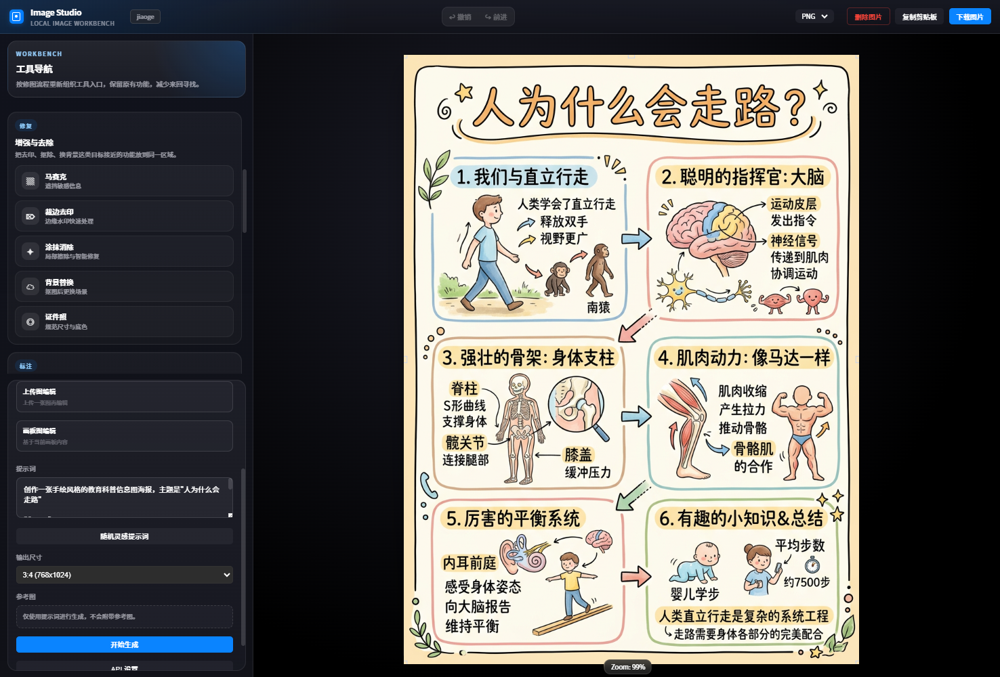

# 极简图片编辑器 (Image Studio)

一款基于 Chrome Manifest V3 开发的极简且专业的浏览器插件图片编辑器。主打"即开即修，本地处理，安全隐私"。

## 界面预览



## 核心特性

### 导入方式

- **点击上传**：点击上传区域选择图片
- **拖拽上传**：直接拖拽图片到编辑区域
- **剪贴板粘贴**：使用 Ctrl+V 直接粘贴剪贴板中的图片

### 基础工具

- **裁剪 (Crop)**：支持自由裁剪，内置常用比例（1:1、3:4、4:3、9:16、16:9），并整合常见平台预设（头像 1:1、朋友圈封面 1280×1184、公众号封面 900×383≈2.35:1、小红书封面 3:4），4x4 网格辅助
- **尺寸调整 (Resize)**：精确修改宽高像素
- **压缩 (Compress)**：有损压缩减小文件体积，支持 JPEG/WebP 格式，实时预览压缩效果
  - **格式选择**：JPEG（兼容性好）/ WebP（压缩率更高）
  - **质量调节**：滑块控制 10%-100%，实时显示预估大小和压缩率
  - **智能计算**：自动计算压缩前后的文件大小对比
- **旋转 (Rotate)**：支持顺时针/逆时针 90°/180° 旋转
- **滤镜 (Filter)**：一键滤镜 + 手动调节双模式
  - **一键滤镜**：内置 6 种专业调色预设
    - 🎞️ **胶片风**：降低对比度 + 棕褐色调 + 噪点效果，营造复古胶片质感
    - 🌃 **赛博朋克**：高饱和 + 高对比 + 紫色调，打造未来科技感
    - 🌸 **日系清新**：提亮曝光 + 降低饱和 + 冷色调，呈现清新淡雅风格
    - ✨ **韩系ins**：低饱和 + 冷色调 + 紫色倾向，适合室内棚拍、探店、冷白皮效果
    - 🌅 **电影日落**：强暖调 + 橙色主导 + 柔和高光，适合黄昏、海边、逆光人像
    - ⚫ **黑白对比**：去色 + 强对比 + 红色滤镜效应，适合街拍、强调线条和眼神
  - **手动调节**：支持亮度、对比度、饱和度精细调整
- **马赛克 (Mosaic)**：画笔式马赛克，支持三种效果模式，用于遮盖敏感信息
  - **纯色块**：经典像素化效果，可调节像素块大小
  - **高斯模糊**：柔和模糊效果，可调节模糊半径
  - **毛玻璃**：模拟真实毛玻璃质感，可调节不透明度
- **图框阴影 (Frame)**：为图片添加边框，支持矩形/圆形两种形状，多种边框风格可选
  - **简约风格**：白边、黑边
  - **艺术风格**：渐变边框、复古相框、拍立得
  - **电影风格**：胶片边框（带齿孔效果，充满复古电影感）
  - **邮票风格**：邮票边框（带齿孔边缘，适合制作个性化邮票）
  - **毛绒绒风格**：奶白、浅驼、樱花粉（模拟毛绒针织肌理，适合宠物、儿童、软萌风图片）
  - 支持多种阴影效果：柔和阴影、强烈阴影、长投影、内阴影
- **裁边去印 (Remove Watermark)**：智能裁剪法，通过选择位置和比例快速移除边缘、角落一类的水印
- **涂抹消除 (Magic Eraser)**：使用画笔涂抹局部区域，适合去除画面中的小物体、文字或瑕疵

### 高级功能

- **OCR 文字识别**：集成百度云 API，一键提取图片中的文字内容，支持结果复制，密钥本地加密存储
- **网格切图**：将图片按指定行列数平均切割，自动打包成 ZIP 下载
- **长图切片**：按指定切片高度纵向连续切图，可设置重叠高度，自动打包成 ZIP 下载
- **文档导出**：统一入口导出 PDF、Word、PPT，支持当前画板导出或上传多张图片合并导出，一张图片对应一页或一张幻灯片
- **证件照**：AI 一键生成标准证件照，支持多种尺寸规格（1寸、2寸等），可选底色，抠图人像支持二次调整
- **AI 背景替换**：智能抠图移除背景，支持纯色或自定义图片背景
- **批量处理中心**：全新批量图片处理工具，支持 7 种常用操作
  - **批量压缩**：JPEG/WebP 格式，质量可调
  - **批量调整尺寸**：指定宽度/高度/百分比缩放
  - **批量裁剪**：支持 1:1、4:3、3:4、16:9、9:16 比例，自动居中裁剪
  - **批量旋转**：顺时针/逆时针 90°、180° 旋转
  - **批量格式转换**：JPEG/PNG/WebP 互转
  - **批量图框**：6 种图框风格（白边、黑边、拍立得、胶片、渐变、复古）
  - **批量添加文本**：自定义内容、位置、大小、颜色，支持阴影效果
  - 一键导出所有处理结果为 ZIP 压缩包
- **批量重命名**：支持批量上传多张图片，自定义重命名规则（前缀/后缀、序号/时间戳命名），一键导出或覆盖原文件
- **拼图功能**：美图秀秀风格拼图工具，支持 30+ 种创意模板，图片拖拽/点击排序，一键保存高清拼图
  - **多种模板**：2-9 张图的各种创意布局（田字、宫格、十字形、左右/上下大等）
  - **智能排序**：支持拖拽排序和点击交换两种图片调整方式
  - **高清导出**：支持导出 1200x1200 高清拼图

### 标注工具

- **添加形状**：集合了箭头、矩形、圆形、直线、菱形等常用标注形状，支持修改线条颜色、粗细及虚实样式
  - **直线**：简洁的直线标注，支持颜色、粗细、虚实样式
  - **菱形**：精美的菱形标注，带阴影效果，支持颜色、粗细、虚实样式
- **连续添加**：标注工具支持连续添加多个形状，无需重复点击工具按钮

### 水印/文字 / 贴纸

- **添加文本**：插入自定义文字，支持**预设样式**（内部资料、保密、绝密、严禁复制），支持**全图平铺水印**模式（可调旋转角度和间距）
- **连续操作**：文字、贴纸、图片水印工具都支持连续添加多个元素
- **趣味贴纸**：内置 16 款 Emoji 表情贴纸 + 8 款精美图标贴纸（书籍、橡皮擦、书签、眼镜、耳机、咖啡、信封、计算器），分类展示，支持拖动、缩放、旋转
- **图片水印**：插入 Logo 或其它图片作为水印，可调整透明度、缩放比例

### 插件工具

- **图标生成**：自动生成浏览器插件所需的多尺寸图标（16x16、32x32、48x48、128x128），支持 AI 文生图
- **AI 图像生成**：集成 Gemini 图像生成与编辑能力，支持文生图、上传图片编辑、当前画板图片编辑，可生成多种常用比例的 AI 图像

### 状态管理

- **撤销/重做**：支持 Ctrl+Z 撤销和 Ctrl+Y 重做，记录完整操作历史。针对 2.4 版本优化：完全支持画布尺寸变更的回溯，撤销提示内容全面汉化。
- **删除图片**：一键删除当前图片并重置编辑器状态

### 导出功能

- **多格式导出**：支持 PNG、JPEG、WEBP 三种格式
- **质量调整**：JPEG/WEBP 格式支持质量参数调整（0.1-1.0）
- **高清导出**：画布缩放仅影响编辑区显示，不降低下载与复制时的图片清晰度
- **文档导出**：支持本地导出 PDF、DOCX、PPTX，无需 OCR、无需后端
- **一键下载**：快速下载处理后的图片
- **复制剪贴板**：一键将结果复制到系统剪贴板

### 界面交互

- **可拖拽侧边栏**：左侧工具栏与预览区之间的分隔线支持左右拖拽调整宽度
- **动态属性面板**：选中工具或画布上的元素后，面板内容动态更新，支持实时参数调整

## 技术栈

- **核心库**：[Fabric.js](http://fabricjs.com/) - 强大的 Canvas 操作库。
- **AI 辅助**：集成 MediaPipe Selfie Segmentation (WebAssembly 加速)。
- **外部 API**：百度智能云 OCR (通用文字识别)。
- **文档导出**：jsPDF、html-docx-js、PptxGenJS。
- **其它**：JSZip (多文件打包), Google Fonts。

## 项目结构

```text
├── assets/             # 静态资源 (截图、二维码等)
├── extension-icons/    # 插件图标资源 (16-128px)
├── lib/                # 第三方依赖库 (Fabric.js, MediaPipe, JSZip等)
├── scripts/            # 核心业务逻辑
│   ├── main.js         # 主入口逻辑，初始化与全局事件处理
│   ├── history.js      # 历史记录管理 (Undo/Redo 逻辑)
│   ├── tools.js        # 各项编辑工具的具体实现 (OCR, 裁剪等)
│   ├── document-export.js # 文档导出模块（PDF / Word / PPT）
│   ├── batch.js        # 批量重命名功能模块
│   ├── batch-processor.js  # 批量处理中心模块（压缩/裁剪/图框/文字等）
│   └── collage.js      # 拼图功能模块
├── background.js       # 插件后台脚本，处理跨域 API 请求
├── styles.css          # 插件整体样式表 (macOS 极简暗黑风格)
├── manifest.json       # Chrome 扩展 Manifest V3 配置文件
└── index.html          # 编辑器主界面 HTML 结构
```

## 更新日志 (Changelog)

### v2.18.0 (2026-03-10)

- **新增功能**

  - 新增统一入口 `文档导出`，支持将当前画板或上传的多张图片导出为 PDF、Word、PPT
  - 支持 `A4 / A3` PDF 页面、Word 文档页、`16:9 / 4:3` PPT 版式
  - 支持 `完整显示` 与 `铺满页面` 两种图片适配方式，全部在本地浏览器内完成，无需 OCR、无需后端
- **交互优化**

  - 文档导出面板支持在 `当前画板` 与 `上传多图` 两种来源之间切换
  - 上传多图后可在面板中预览、移除、清空，并自定义导出文件名
  - 当前画板导出逻辑与连续操作面板协同，避免选中画布对象时打断导出面板

### v2.17.0 (2026-03-10)

- **裁剪优化**

  - 将平台尺寸预设整合进统一的裁剪比例列表，去除重复选择项
  - 新增常见平台裁剪预设：头像、朋友圈封面、公众号封面、小红书封面
- **新增功能**

  - 新增长图切片工具，支持按高度连续切片并导出 ZIP
- **体验优化**

  - 修复大图在编辑区缩放显示后导出变模糊的问题，下载与复制保持原始清晰度
  - 导航文案优化：`去水印` 调整为 `裁边去印`，`消除笔` 调整为 `涂抹消除`，`添加图片` 调整为 `图片水印`
- **AI 生图增强**

  - 支持 Gemini 文生图、上传参考图编辑、当前画板图片编辑三种模式
  - 随机灵感提示词扩展为主体、背景、内容、风格、尺寸 5 个维度组合，并自动联动输出比例
- **导航与布局改版**

  - 左侧导航重组为 5 个功能区：基础处理、增强与去除、说明与装饰、识别与生成、切图与批量
  - 工具入口升级为图标 + 名称 + 简述的卡片式导航，参数面板升级为 Inspector 结构

### v2.16.0 (2025-02-28)

- **新增功能**：
  - **批量处理中心**：全新批量图片处理工具，一站式解决多张图片处理需求
    - 支持 7 种批量操作：压缩、调整尺寸、裁剪、旋转、格式转换、图框、添加文字
    - 批量裁剪：支持 5 种常用比例（1:1、4:3、3:4、16:9、9:16），自动居中裁剪
    - 批量图框：6 种精美图框风格（简约白边/黑边、拍立得、胶片、渐变、复古）
    - 批量添加文字：支持 5 个位置（四角+居中），可调节大小、颜色，带阴影效果
    - 实时进度显示，处理完成后一键导出 ZIP 压缩包
    - 独立弹窗设计，不依赖 Fabric Canvas，与单张编辑互不干扰
  - **UI 优化**：批量处理中心采用 1×7 水平工具栏布局，图标+文字垂直排列，美观省空间
  - **体验优化**：批量处理、插件图标、AI 生图功能无需先上传图片即可使用

### v2.15.0 (2025-02-28)

- **新增功能**：
  - **一键滤镜扩展**：新增 3 种专业调色预设
    - ✨ **韩系ins风**：低饱和 + 冷色调 + 紫色倾向，适合室内棚拍、探店、冷白皮效果
    - 🌅 **电影感日落**：强暖调 + 橙色主导 + 柔和高光，适合黄昏、海边、逆光人像
    - ⚫ **黑白对比**：去色 + 强对比 + 红色滤镜效应，适合街拍、强调线条和眼神
    - 一键滤镜总数达到 6 种，覆盖更多使用场景

### v2.14.0 (2025-02-28)

- **新增功能**：
  - **一键滤镜**：滤镜功能重大升级
    - 新增 3 种专业调色预设：胶片风、赛博朋克、日系清新
    - 胶片风：降低对比度 + 棕褐色调 + 噪点效果
    - 赛博朋克：高饱和 + 高对比 + 紫色调
    - 日系清新：提亮曝光 + 降低饱和 + 冷色调
    - 一键应用，自动保存到历史记录
    - 保留手动调节模式，支持精细调整

### v2.13.0 (2025-02-28)

- **新增功能**：
  - **图片压缩**：全新有损压缩功能
    - 支持 JPEG 和 WebP 两种输出格式
    - 质量滑块调节（10%-100%）
    - 实时预估压缩后文件大小和压缩率
    - 压缩完成后显示详细的压缩统计信息
    - 一键应用压缩并保存到历史记录

### v2.12.0 (2025-02-27)

- **新增功能**：
  - **拼图功能**：全新美图秀秀风格拼图工具
    - 支持 30+ 种创意模板（2-9 张图的各种布局）
    - 模板类型包括：田字格、九宫格、左右/上下大图、十字形等
    - 支持拖拽排序和点击交换两种图片调整方式
    - 高清导出 1200x1200 分辨率拼图
    - 每次打开自动重置为初始状态

### v2.11.0 (2025-01-30)

- **新增功能**：
  - **图框效果升级**：新增两种精美边框风格
    - **胶片边框**：黑色边框带电影齿孔效果，给照片带来强烈的复古感和电影叙事感
    - **邮票边框**：米白色纸张质感边框，四周带有连续的小半圆凹槽齿孔，适合制作个性化邮票效果

### v2.10.0 (2025-01-30)

- **新增功能**：
  - **批量重命名**：全新批量操作功能，支持：
    - 批量上传多张图片（点击或拖拽）
    - 自定义重命名规则：前缀/后缀、序号命名（可设置起始序号和位数）、时间戳命名、日期时间命名
    - 实时预览新文件名
    - 一键导出所有文件为 ZIP 压缩包
    - 支持覆盖原文件（下载方式）

### v2.9.0 (2025-01-29)

- **新增功能**：
  - **高级马赛克**：新增纯色块、高斯模糊、毛玻璃三种效果模式。
  - **图框阴影**：新增简约、艺术、毛绒绒等多种边框风格，支持圆角与阴影调节。
  - **标注升级**：新增**直线**和**菱形**标注工具；支持图形/文字/贴纸的**连续添加**模式。
  - **文本增强**：增加“内部资料”、“绝密”等预设水印样式。
  - **贴纸库**：新增 8 款精美图标贴纸（办公/生活类）。
- **问题修复**：
  - 修复证件照功能因 WebAssembly CSP 限制导致的 `CompileError` (Manifest V3)。
  - 修复 Fabric.js 库中无效枚举值 `alphabetical` 导致的控制台错误。
  - 优化 MediaPipe 组件，消除控制台多余的日志输出。

## 安装与使用

1. 下载或克隆本项目到本地。
2. 打开 Chrome 浏览器，访问 `chrome://extensions/`。
3. 开启右上角的“开发者模式”。
4. 点击“加载已解压的扩展程序”，选择本项目所在的文件夹。
5. 点击插件图标即可开始使用。

## OCR 识别指引

本项目 OCR 功能依赖百度智能云，使用前需配置：

1. 访问 [百度智能云控制台](https://console.bce.baidu.com/) 获取 API Key。
2. 密钥**仅本地存储**在您的浏览器缓存中，不会泄露至服务器。

## AI 图像生成指引

本项目集成了两套 AI 生图功能，分别用于不同的应用场景：

### 1. AI 图像生成（通用图像生成）

用于生成通用 AI 图像，基于 **Gemini** 图像生成模型：

| 项目               | 内容                                                                                |
| ------------------ | ----------------------------------------------------------------------------------- |
| **模型**     | `gemini-3.1-flash-image-preview`（不可用时自动回退到 `gemini-2.5-flash-image`） |
| **API 地址** | `https://generativelanguage.googleapis.com/v1beta/models/{model}:generateContent` |
| **提供商**   | Google Gemini API                                                                   |

**使用方法：**

1. 访问 [Google AI Studio](https://aistudio.google.com/app/apikey) 创建 API Key
2. 在编辑器中点击 `AI生图` 功能
3. 首次使用会弹出配置框，输入 API Key 并保存
4. 输入图像描述（prompt），选择尺寸比例后点击生成

### 2. AI 图标生成（插件图标生成）

用于生成浏览器插件图标，基于 **Gemini** 模型：

| 项目                    | 内容                                                                              |
| ----------------------- | --------------------------------------------------------------------------------- |
| **模型**          | Gemini-2.5-flash-image-preview                                                    |
| **默认 API 地址** | `https://yunwu.ai/v1beta/models/gemini-2.5-flash-image-preview:generateContent` |
| **提供商**        | 云雾AI (yunwu.ai) 或 Google AI                                                    |

**使用方法：**

1. 获取 API Key（推荐 [云雾AI](https://yunwu.ai) 或 [Google AI Studio](https://aistudio.google.com/app/apikey)）
2. 在编辑器中点击 "图标生成" 功能
3. 输入 API Key 和图标描述
4. 点击生成多尺寸图标

**注意：** 你也可以在配置面板中修改 API 地址，使用其他支持 Gemini 图像生成的服务商。

## AI 生图补充说明

- `AI生图` 面板现支持三种模式：`文生图`、`上传图编辑`、`画板图编辑`
- 随机灵感提示词现按 `主体`、`背景`、`内容`、`风格`、`尺寸` 5 个维度组合生成，并自动匹配输出比例
- 直接调用 Google Gemini API 时，仍可能受到可用地区限制

## 隐私声明

本项目所有图片处理均在本地浏览器内完成，OCR 请求直接发送至百度云官方接口。除 OCR 必要参数外，不上传任何数据到第三方服务器，确保您的数据隐私安全。
